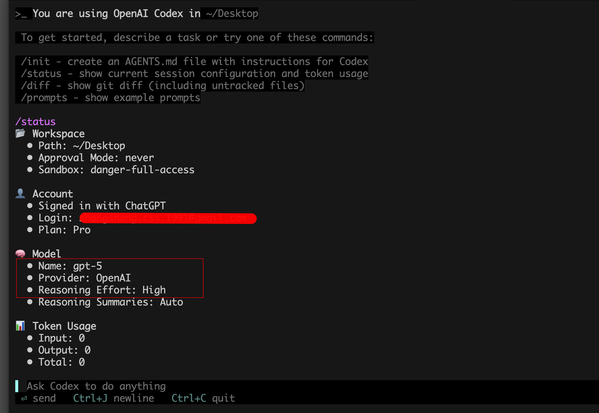
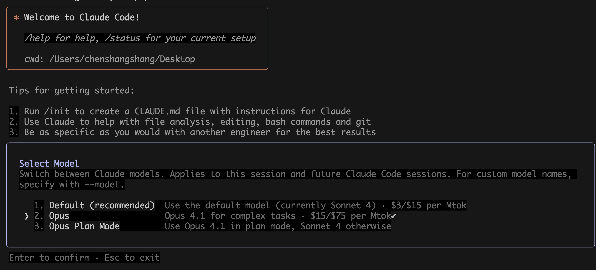

# ChatGPT 5 Pro 拼车 | Codex 高端拼车 | 3 人一车 | 560 元/人/月

想要更快、更稳、更像资深工程师地写代码？我们组织「ChatGPT 5 Pro 拼车 + Codex 高端拼车」，3 人一车，均摊成本，每人每月仅 560 元，轻松拥有强劲的工程化编码能力与稳定产出。支持关键词：5 Pro 拼车、ChatGPT 5 Pro 拼车、Codex 高端拼车。

---

## 为什么选 ChatGPT 5 Pro + Codex

- 强工程化能力：从脚手架到模块设计、从重构到单测覆盖，能按工程师思路完备交付。
- 跨语言迁移：在 TS/Go/Python/Java/Rust 等多栈间自如切换，迁移快、坑少。
- 复杂重构与性能优化：给出可落地的重构方案和具体优化点，并能生成基准测试。
- 工具/Agent 协作：能把任务拆解成步骤，调用工具链产出“可运行”的结果，而非只给片段。
- 长上下文规划：复杂需求可分阶段推进，持续记忆上下文，减少返工与沟通成本。
- 可解释与可控：每一步给出理由、权衡与替代方案，方便你把控方向。

> 实战体验中，Codex + ChatGPT 5 Pro 在复杂工程与多文件协同方面的效率与质量，显著优于常见代码助手。

---

## 对比 ClaudeCode（核心体验）

- 复杂项目落地：在多文件、多模块协同、接口契约一致性上更稳，减少“生成可读、不可运行”的情况。
- 需求到产出链路：从 API 设计、数据建模到实现与测试的“端到端”交付更完整。
- 调参与纠错：对报错上下文的抓取与自纠更快，能给出复现与修复步骤。
- 文档与注释：同步生成 README/变更记录/迁移指南，便于团队协作落地。

注：以上为大量真实项目与内部评测中的综合体验对比，侧重工程可落地性与吞吐稳定性；不同项目/团队可能存在差异，欢迎你亲测验证。

---

## 拼车方案

- 模式：3 人一车（固定车队，稳定可用）
- 费用：560 元/人/月（均摊不抬价，透明）
- 开车时间：凑满即开，周期月结
- 适用人群：有明确项目/学习目标、追求稳定与效率的开发者/团队
- 权益保障：使用规范与时段协调，避免互相影响
- 轻量服务：简单环境配置/提示词优化/用法建议

---

## 适用场景范例

- 新项目从 0–1：脚手架、模块化设计、接口/数据库建模、测试体系
- 旧项目重构：模块解耦、性能剖析、可观测性接入、迁移指引
- 跨栈迁移：Python → Go/Java/Rust，或前后端协同一体化方案
- 自动化与工具链：CI/CD、Lint/Format、测试框架、监控/告警接入
- 文档化交付：README、设计文档、变更记录、Onboarding 指南

---

## 立即上车｜加我 v 信

有意向了解/拼车上车，直接加我微信，备注「高端局拼车」。

更多详情可见：`ChatGPT 5 Pro - Codex 高端拼车.md`

---

## 搜索关键词

5 Pro 拼车、ChatGPT 5 Pro 拼车、Codex 高端拼车、ChatGPT5Pro 拼车、AI 拼车、3 人一车、560 元/月、代码助手拼车、工程化编码。
